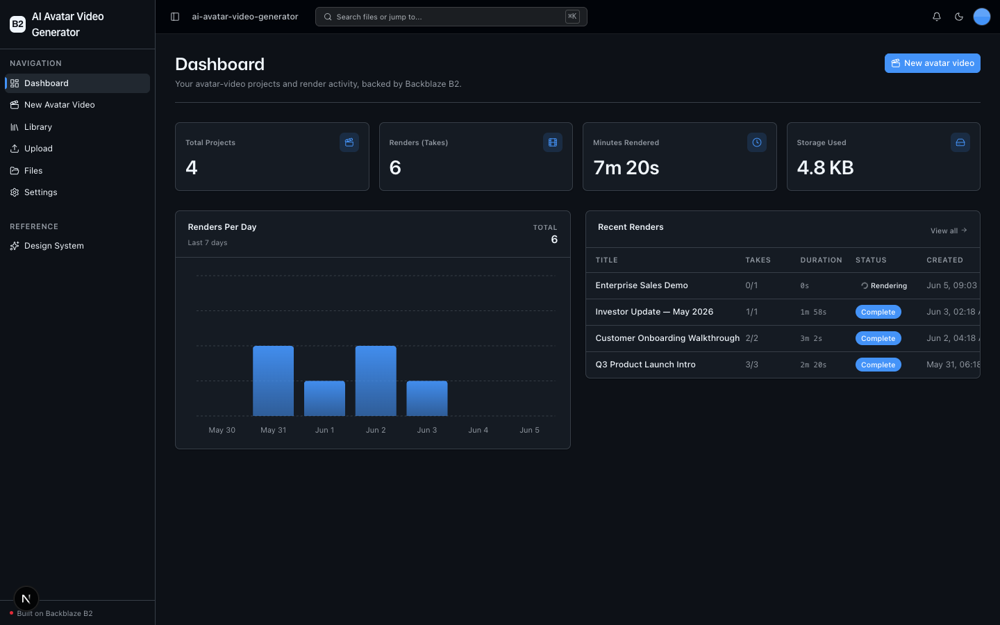
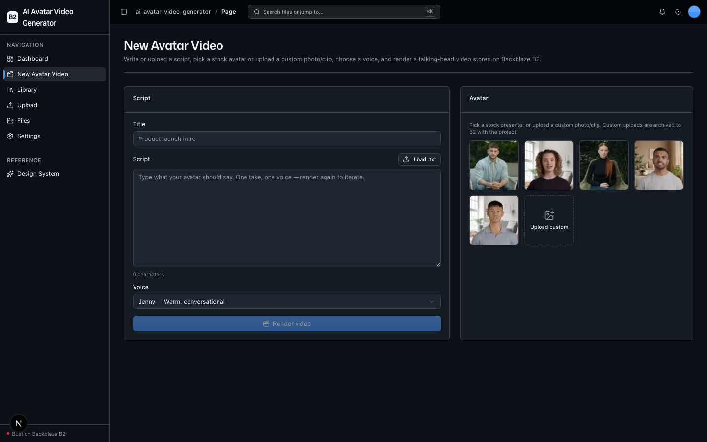
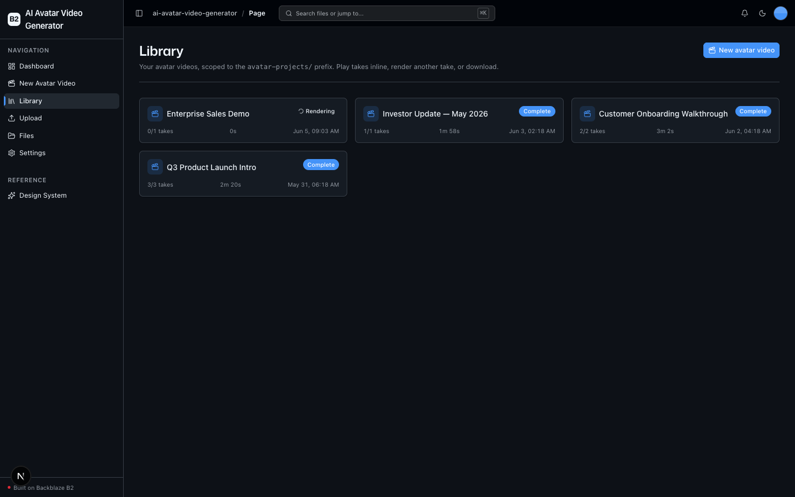

<!-- last_verified: 2026-06-03 -->
# AI Avatar Video Generator

Turn a **script + an avatar** into a **talking-head video with synced voice**, all
stored on **[Backblaze B2](https://www.backblaze.com/cloud-storage?utm_source=github&utm_medium=referral&utm_campaign=ai_artifacts&utm_content=b2ai-avatar-video-generator)**.
Type or upload a script, pick a stock avatar or upload a custom photo/clip, choose a
voice, and render a video. Every render ("take") is archived per project, so you can
iterate — multiple takes per script — and compare them side by side. It's a
HeyGen / Synthesia / D-ID-style demo built to show B2 as the **sole datastore** for a
media-heavy, iterative AI workload: scripts, custom avatar references, and rendered MP4s
all live in the bucket, and a per-project `project.json` manifest is the record of truth.
**No database.**

**What you get out of the box:**
- **New Avatar Video studio** (`/create`) — script (type or `.txt` upload), avatar picker
  (stock catalog + custom upload), voice select, one click to render.
- **Scoped Library** (`/library`) — per-project archive (scoped to `avatar-projects/`)
  with inline `<video>` playback streamed from presigned B2 URLs, take/iteration history,
  "render another take", download, and delete.
- **Pluggable providers** — D-ID by default (real free trial, no credit card), FAL as an
  alternate adapter, HeyGen documented as an extension slot.
- **Full-bucket File Explorer** (`/files`) and **generic Upload** (`/upload`) — the
  reusable B2-backed scaffolding inherited from the starter kit.
- FastAPI backend with a strict layered architecture, structural tests, and `boto3`
  contained to a single module.

## What it looks like

**Dashboard** — project and render metrics (total projects, takes, minutes rendered, storage), a 7-day renders-per-day chart, and a recent-renders table with status and duration.



**New Avatar Video** — script editor (type or upload a .txt file), stock avatar picker with provider thumbnails, voice selector, and a single Render video button.



**Library** — project grid scoped to avatar-projects/, showing each project's title, take count, total duration, status badge, and creation date.



## How it works

```
Script + avatar  ─▶  POST /projects  ─▶  project.json + script.txt (+ avatar) in B2
                                            │
                          BackgroundTasks render job (service/render.py)
                                            │
   provider create ─▶ poll until done ─▶ download MP4 from result URL ─▶ put to B2
                                            │
                              takes/<take_id>.mp4 + manifest rewritten
                                            │
                       Library streams the take inline from a presigned B2 URL
```

### B2 storage layout (per-project archive)

```
avatar-projects/<id>/project.json         manifest — record of truth (status, avatar, voice, takes[])
avatar-projects/<id>/script.txt           durable script text
avatar-projects/<id>/avatar.<ext>         custom avatar (only when uploaded)
avatar-projects/<id>/takes/<take_id>.mp4  each rendered take (the iteration story)
uploads/                                  generic Upload page (kept scaffolding)
```

## Quick Start

You need: Node.js >= 20, pnpm >= 9, Python >= 3.11, a free
**[Backblaze B2 account](https://www.backblaze.com/cloud-storage?utm_source=github&utm_medium=referral&utm_campaign=ai_artifacts&utm_content=b2ai-avatar-video-generator)**,
and an avatar-video provider key (D-ID has a free trial — see below).

### Setup

**1. Install dependencies**

```bash
pnpm install
```

**2. Set up the backend**

```bash
cd services/api
python -m venv .venv && source .venv/bin/activate
pip install -r requirements.txt
cd ../..
```

**3. Add your B2 credentials**

```bash
cp .env.example .env
```

Open `.env`, then head to the [Backblaze B2 dashboard](https://secure.backblaze.com/b2_buckets.htm?utm_source=github&utm_medium=referral&utm_campaign=ai_artifacts&utm_content=b2ai-avatar-video-generator) and:

1. **Create a bucket.** Paste each value into `.env`:
   - **Bucket Unique Name** → `B2_BUCKET_NAME`
   - the region segment of the bucket's S3 endpoint → `B2_REGION`
2. **Create an application key** with `Read and Write` permission:
   - **keyID** → `B2_APPLICATION_KEY_ID`
   - **applicationKey** → `B2_APPLICATION_KEY` *(only shown once — paste it now)*

> Walkthroughs: [creating a bucket](https://www.backblaze.com/docs/cloud-storage-create-and-manage-buckets?utm_source=github&utm_medium=referral&utm_campaign=ai_artifacts&utm_content=b2ai-avatar-video-generator) and [creating app keys](https://www.backblaze.com/docs/cloud-storage-create-and-manage-app-keys?utm_source=github&utm_medium=referral&utm_campaign=ai_artifacts&utm_content=b2ai-avatar-video-generator).

**4. Add a provider key**

The default provider is **D-ID** — it has a real free trial through the API: a 14-day
trial grants ~20 credits (≈5 minutes of video), **no credit card required** (renders are
watermarked on the trial tier). Sign up at [d-id.com](https://www.d-id.com/), create an
API key, and set it in `.env`:

```
AVATAR_PROVIDER=did
DID_API_KEY=your_did_api_key
```

Prefer pay-per-use lip-sync models? **FAL** ([fal.ai](https://fal.ai/), $20 free signup
credits) is the scaffolded alternate adapter — set `AVATAR_PROVIDER=fal` and `FAL_KEY=...`.
**HeyGen** is documented as a third adapter slot in
[docs/features/avatar-providers.md](docs/features/avatar-providers.md) (its API generally
needs a paid plan, so it is not the free default).

> Provider API keys are read server-side only and are **never** exposed to the client.

**5. Run it**

```bash
pnpm dev
```

Frontend at `localhost:3000`, API at `localhost:8000`. Go to **New Avatar Video**, write a
short script, pick an avatar and voice, and click **Render video** — you land on the
project in the Library and watch the take finish rendering.

`pnpm dev` runs `pnpm doctor` first — a preflight check for the common setup gotchas
(wrong Node/Python version, missing venv, missing or placeholder `.env`, busy ports). Run
it standalone any time with `pnpm doctor`.

## Core Features

- [New Avatar Video studio](docs/features/create-studio.md) — script + avatar + voice → render
- [Render job](docs/features/render.md) — provider create → poll → download → archive to B2; multiple takes per script
- [Scoped Library](docs/features/library.md) — per-project archive, inline video playback, take history, download, delete
- [Pluggable avatar providers](docs/features/avatar-providers.md) — D-ID default, FAL alternate, HeyGen extension slot
- [File Upload](docs/features/file-upload.md) — drag-and-drop upload with real-time progress (kept scaffolding)
- [File Browser](docs/features/file-browser.md) — list, preview, download, delete files (kept scaffolding)
- [Take metadata](docs/features/metadata-extraction.md) — video duration (MP4 header) + checksums
- [Dashboard](docs/features/dashboard.md) — projects, renders, minutes rendered, storage; renders-per-day chart
- [Design System](docs/design-system.md) — tokens, primitives, the blaze loader, inline error/empty states. Live at `/design`.

## Agent-First Architecture

This repo is optimized for coding agents. **[AGENTS.md](AGENTS.md) is the single source of
truth** — a short entry point with the repo layout, architectural invariants, commands,
and pointers to deeper docs. Architecture is enforced mechanically (layering, import
boundaries, file-size limits, and SDK containment are verified by structural tests + lints):

| Principle | Implementation |
|-----------|---------------|
| Single source of truth for agents | AGENTS.md — layout, invariants, commands, conventions |
| Enforce invariants mechanically | Structural tests + ruff + ESLint verify boundaries |
| Strict layered architecture | `types -> config -> repo -> service -> runtime`, enforced by tests |
| Contain external SDKs | `boto3` only in `repo/b2_client.py` — verified by structural test |
| B2 is the sole datastore | `project.json` manifest per project; no database |
| Keep files agent-sized | 300-line limit per file, enforced by test |
| Docs updated with code | Same-PR requirement prevents documentation rot |

## Tech Stack

- TypeScript, Next.js 16, React 19, Tailwind v4, shadcn/ui, Recharts
- TanStack Query — caching, dedup, retry, polling for every fetch
- Python 3.11+, FastAPI, boto3, Pydantic v2, httpx
- Backblaze B2 (S3-compatible object storage) — the sole datastore
- Avatar-video providers: D-ID (default), FAL (alternate), HeyGen (extension slot)
- pnpm workspaces (monorepo)

## Commands

| Command | What it does |
|---------|-------------|
| `pnpm dev` | Start frontend + backend |
| `pnpm dev:web` | Frontend only |
| `pnpm dev:api` | Backend only |
| `pnpm build` | Build frontend |
| `pnpm lint` | Lint frontend |
| `pnpm lint:api` | Lint backend (ruff) |
| `pnpm test:api` | Run backend tests |
| `pnpm check:structure` | Verify layering rules |
| `pnpm test:e2e` | Playwright e2e tests (run `pnpm --filter @ai-avatar-video-generator/web exec playwright install chromium` once first) |

## Documentation Map

| Doc | Purpose |
|-----|---------|
| [AGENTS.md](AGENTS.md) | Agent table of contents — start here |
| [ARCHITECTURE.md](ARCHITECTURE.md) | System layout, layering, data flows |
| [docs/features/](docs/features/) | Feature docs (studio, render, library, providers, upload, browser, metadata, dashboard) |
| [docs/design-system.md](docs/design-system.md) | Design tokens, primitives, loader, error/empty states |
| [docs/app-workflows.md](docs/app-workflows.md) | User journeys |
| [docs/dev-workflows.md](docs/dev-workflows.md) | Engineering workflows and testing |
| [docs/SECURITY.md](docs/SECURITY.md) | Security principles |
| [docs/RELIABILITY.md](docs/RELIABILITY.md) | Reliability expectations |
| [docs/exec-plans/](docs/exec-plans/) | Execution plans and tech debt tracker |

## FAQ

**Do I need a credit card to try it?**
No. The default provider, D-ID, offers a 14-day free trial (~20 credits, ≈ 5 minutes of
video) with no credit card required. Trial renders are watermarked.

**Does it need a database?**
No. Backblaze B2 is the sole datastore. Each project's `project.json` manifest, script,
optional custom avatar, and rendered MP4 takes all live in the bucket.

**Which avatar-video providers are supported?**
D-ID by default, FAL as a pay-per-use alternate adapter, and HeyGen documented as an
extension slot. Switch providers with the `AVATAR_PROVIDER` env var.

**Is this an open-source alternative to HeyGen / Synthesia / D-ID?**
It's a HeyGen / Synthesia / D-ID-style demo app showing Backblaze B2 as the storage layer
for a media-heavy, iterative AI workload — not a hosted product.

**Where are videos stored and how are they served?**
In your B2 bucket under `avatar-projects/<id>/takes/`. The Library streams each take inline
via short-lived presigned B2 URLs.

## Out of scope (v1)

Multi-scene composition / ffmpeg concat; custom voice cloning; real-time streaming
avatars; provider webhooks (we poll). All noted as extension points in the docs.

## License

MIT License - see [LICENSE](LICENSE) for details.

## Claude Agent B2 Skill

Manage Backblaze B2 from your terminal using natural language (list/search, audits, stale
or large file detection, security checks, safe cleanup).

Repo: [https://github.com/backblaze-b2-samples/claude-skill-b2-cloud-storage](https://github.com/backblaze-b2-samples/claude-skill-b2-cloud-storage)
